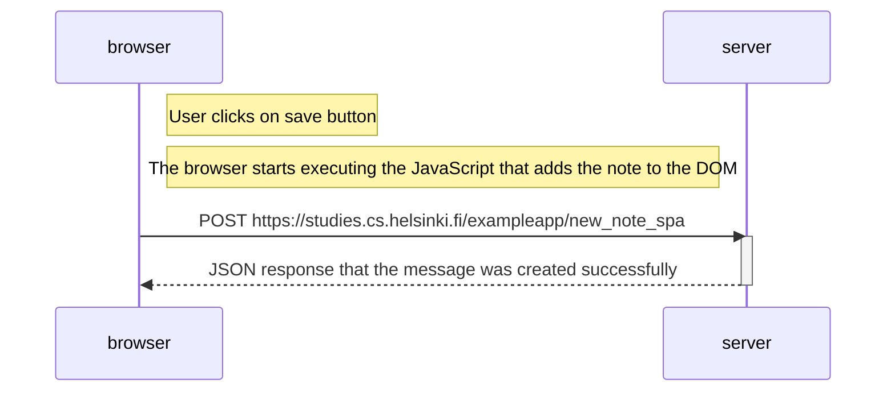

```mermaid
sequenceDiagram
    participant browser
    participant server

    Note right of browser: User clicks on save button
    Note right of browser: The browser starts executing the JavaScript that adds the note to the DOM

    browser->>server: POST https://studies.cs.helsinki.fi/exampleapp/new_note_spa
    activate server
    server-->>browser: JSON response that the message was created successfully
    deactivate server
```